Jake Markus and [Aleksander Mekhanik](mailto:aleksander.j.mekhanik.26@dartmouth.edu)  
Dartmouth Engs31 \- Tad Truex  
22 August 2024  
Six-operation FPGA Calculator 

Table of Contents

1. Intended user experience 							page 1  
2. Top level design diagrams							page 3  
3. Modular breakdown								page 5  
4. Testing 										page 10  
5. Final code and result video  
6. Reflections, wishes, and support acknowledgements

# **I.    Intended user experience** 

**\-Intended Use Sequence:** 

1. User enters the first number (A) by sequentially pressing each number, starting with the most significant digit. It is displayed.   
2. The user selects an operation using the keymap below.   
3. The user enters the second number (B) in the same manner as A. He may press clear once to clear B. Pressing clear twice in a row starts over by  clearing A and B, and returning to Step 1\.   
4. The user presses equal to view the final result. He may press clear to return to Step 1 with a blank slate for the next calculation. If he wants to repeat the last operation, he may press equal again as many times as he wants. 

Constant Features: The Basys' LED 0 is lit up when A is being displayed, and LED 1 is lit when B is displayed, to help keep track of the process.   
**\-Operation Keymap:**   
Advanced Switch: OFF							Advanced Switch: ON

| A | Add |  | A | Add |
| :---- | :---- | :---- | :---- | :---- |
| B | Subtract |  | B | X |
| C | Multiply |  | C | X |
| D | Divide |  | D | Divide |
| E | Equals |  | E | Equals |
| F | Clear |  | F | Clear |

**Limitations**

1. The Basys3 FPGA only has a four digit seven segment display. Therefore, the max displayable number is 9999\.   
2. This is a positive integer calculator. Fractional and negative numbers are not supported. The lowest display is 0000\.   
3. If the limit (9999) is exceeded, the result rolls over, except in the case of exponent where it is not calculated.   
4. Any number divided by 0 is said to be 0000\. Ideally we would crash the universe, but further research is needed.

# **II.     Top level design diagrams**

**Full Shell with each module:**    
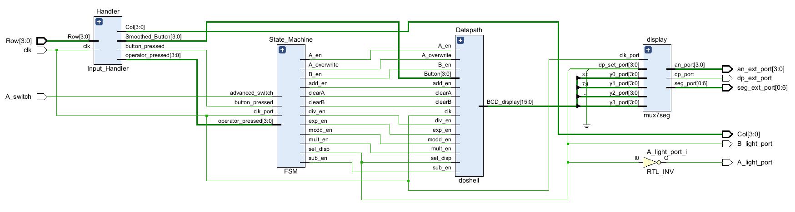  

**High Level Notes:** When a button is pressed, Handler reads it from the keyboard.  If it's a digit (0-9), it notifies the FSM via *Smoothed\_Button* (0-9) and *button\_pressed* (monopulsed notification bit), which then tells the datapath to take it into the correct number (A or B). If it's an operation (inputed after A), the FSM stores it from *operator\_pressed* (A-F) and, when equals is pressed, tells the Datapath to carry out the correct operation via one of six signals (*add\_en, sub\_en, etc., monopulsed*). All along the way, the FSM is telling the Datapath which number (A or B) the user ought to see via *sel\_disp*. This is sent to the display module which converts four digit BCD (0000-9999) to the electrical signals the seven segment display needs.   
**To understand the specifics of each signal and module, refer to the module-specific documentation.**   
**Calculator Inputs** 

| *Name* | *Source*  | *Notes* |
| :---- | :---- | :---- |
| Row\[3:0\] | What the Digilent PmodKYPD keypad returns.  | Given selected column, tells which row(s) are pressed. "1101" means row 3 is down. Consult Handler documentation. |
| clk | Internal system clock (100 MHz.) |  |
| A\_switch | Basys switch 0 | The Advanced mode toggler |

             
**Calculator Outputs** 

| *Name* | *Destination* | *Notes* |
| :---- | :---- | :---- |
| Col\[3:0\] | Sent to Digilent PmodKYPD keypad.. Consult Handler documentation. |  |
| A\_light\_port | LD0 on Basys | On if A is being displayed |
| B\_light\_port | LD1 on Basys | On if B is being displayed (just not A) |
| An\_ext\_port\[3:0\],  seg\_ext\_port\[0:6\], dp\_ext\_port | Basys' seven segment display | Selects a digit by its anode and then lights up the segments of said digit. Electrical stuff\! Rotates really quickly, no flashing.  |

# **III.    Modular Breakdown**

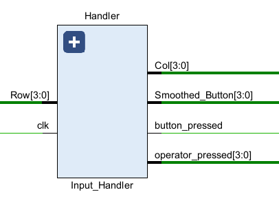

**Input Handler**

Inputs				                           	Outputs

| Row\[3:0\] | Returned by keyboard hardware. "1011" corresponds to a press on row two.  |  | Col\[3:0\] | Cycles between "0111," "1011," "1101," "1110." Fed directly to the keyboard to read it.   |
| :---- | :---- | :---- | :---- | :---- |
| clk | Basys System clock.  |  | Smoothed\_Button\[3:0\] | Value of the last digit (0-9) pressed, i.e. (0000-1001) |
|  |  |  | button\_pressed | Monopulsed every time a digit is pressed.  |
|  |  |  | operator\_pressed | Monopulsed operator (A-F) i.e. (1010-1111) |

This was one of the tricker parts of this project\! Check out exactly how the keyboard hardware works here:   
[**https://digilent.com/reference/\_media/reference/pmod/digilent-pmod-interface-specification.pdf**](https://digilent.com/reference/_media/reference/pmod/digilent-pmod-interface-specification.pdf)  
This means our handler has some funky processing to do. Here's how I handled that:   
Handler has a clock divider that changes Col every 1ms, from "0111" \-\> "1011" \-\> "1101" \-\> "1110" to read each column. That's great, but it's only reading a pressed button ¼ of the time, so a held '5' would go from low to high, high to low over and over again. How do we differentiate between a continuous hold, and a new press? To each button pressed, an additional bit (lovingly called 'flopper') is appended. When no release is detected, flopper stays the same. When a release is detected (all rows are "1111," as measured by 'held' \= '0000'), flopper is flipped (0-\>1, 1-\>0), but the appended bit on the previous number stays the same. Therefore, when the next '5' is pressed on the keyboard, the flopper appended is the opposite value. That tells a process constantly comparing curr\_button and last\_button that it really is a different press, even though both are fives\! The flopvalues are different. Then, we can truncate curr\_button back to '5' (0101) to send it to the rest of the calculator. See this nifty chart\! The appended flopper is the underlined first digit.

| Keyboard Action | Handler State |
| :---- | :---- |
| 5 is being held | Flopper \= 0 Curr\_button \= 00101 Last\_button \= 00101 |
| 5 is released (no output necessary) | Flopper \= 1 Curr\_button \= 00101 Last\_button \= 00101 |
| First clock cycle 5 is pressed again.  *Curr\_button \=/= Last\_Button, so we output 0101\!*  | Flopper \= 1 Curr\_button \= 10101 Last\_button \= 00101 |
| 5 is being held  | Flopper \= 1 Curr\_button \= 00101 Last\_button \= 00101 |
| 5 is released | Flopper \= 0 Curr\_button \= 00101 Last\_button \= 00101 |

**State Machine**

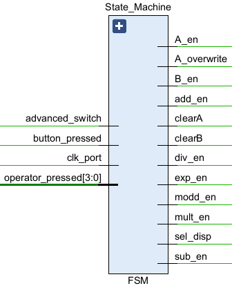

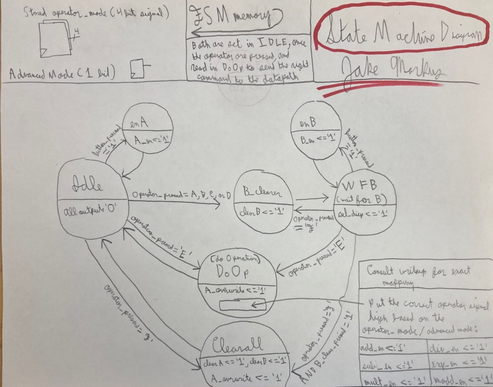

It's a very classic state machine, except the stored operator input (Add, Subtract, etc.) affects which of the following signals is monopulsed in the DoOp stage: *add\_en, sub\_en, mult\_en, div\_en, exp\_en, modd\_en*. For instance, operator\_pressed \= '1010' and advanced\_switch \='1' eventually results in *exp\_en* being monopulsed because A in advanced mode is coded as the exponent operation.  *A\_overwrite* overwrites all of A's digits from the operate block, while *A\_en/B\_en* only takes in one digit and shifts the rest.   

**Datapath**   
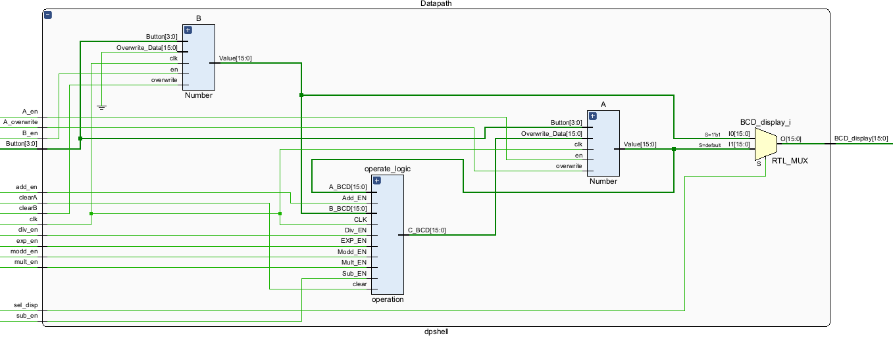  

The datapath is composed of three sub-blocks: two numbers (A,B) and a block to perform different functions on them (operation\_logic). The output of the operation overwrites all the digits of the first number inputted (A) since it is no longer needed. B is potentially necessary for sequential operations. The correct number (A or B) is outputted to the display.   
Here's a breakdown of the two files (number and operate\_logic): 

**Datapath Sub-blocks**   
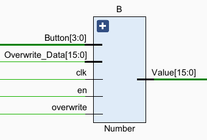

**Inside number**, a 4x4 regfile stores 4 BCD digits. When overwrite is high, Overwrite\_Data replaces all four digits. When en is high, the digits shift upwards and Button\[3:0\] is fed into the lowest significant digit. For instance, if *en* goes high when *button* is 5 and the current regfile is 9786, then the updated regfile becomes 7865\. This allows for a user to sequentially input a number.

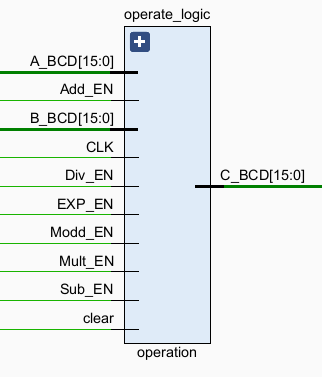

**Inside operate\_logic**, A\_BCD and B\_BCD are converted to binary. These are then cast to integers to asynchronously calculate signals for their sum, difference, product, quotient, and mod. The calculation process for exponent is different, though. A 14x16 regfile stores 14 numbers that sequentially cascade the multiplication operation. The first is always 1\. The second becomes A. The third becomes A\*A. the fourth becomes A\*A\*A, etc. Every clock cycle, one of the indexes is updated, and after 13 clock cycles it becomes up to date. Luckily, we found it impossible to press '=' in 0.13 μ-seconds. If someone knows the Flash please put us in contact for further testing. B determines the index of the requested power. All of these outcomes are muxed by each en input ( *add\_en, sub\_en, mult\_en, div\_en, exp\_en, modd\_en*) into C, which is then converted back to BCD and outputted. 

# **IV.     Testing**

The main logical functionality of the calculator lies in the interaction between the datapath and state machine, which I have called the core. The  keyboard hardware and electrical outputs create unintuitive and unnecessary layers of complexity, and can be modeled separately. Therefore, in these core simulations, I have directly inputted the output of Input\_Handler, and observed the BCD output. 

Here is a multiplication operation: 96x8 \= 768\. You can track the FSM states progress from taking in each digit of A, taking in the single digit of B, and finally doing the operation. In addition, the BCD display shows A, B, and then the answer (from A again).   
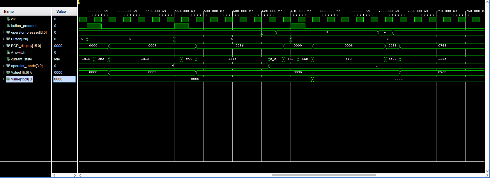  

Similarirly, the Datapath displays the correct output on BCD\_display, and is outputting the correct result, 768\.  
All of the other standard operations result in completely identical testbenches, only where the output is changed. The one interesting case is exponent, for the reasons documented above. Here is another simulation showcasing the cascading regfile for 2^6 \= 64:   
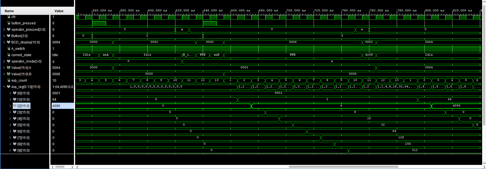  

Since A was raised to the power of 6, exp\_reg\[6\] was outputted even though 128, 256\. 512…etc. were also calculated.  exp\_count determines which index of the regfile is updated. Note A\_switch is high since we are in advanced mode\! The FSM is taking in operator\_mode and A\_switch correctly, and interpreting it properly as the exponent function. 

The other main testbench was for the Input Handler. Note that it's extremely hard to simulator because divider theoretically requires 100000 clock cycles to active Col for the first time\! I helped this by having divider increment by 10 instead of 1, but it's still a big simulation.

Here, a button is pressed (1). That's because 0111 is sent out to read the first column, and 0111 read is the first row. As you can see, Smoothed\_Button is updated, and button\_pressed is monopulsed. Huzzah\!   

Next, here's when an operator is pressed. Here, Smoothed\_Button is updated, but button\_pressed isn't monopulsed, because 'F' is not a number. Instead, operator\_pressed is monopulsed as a four bit bus. Huzzah x2\!   

We didn't test the 7seg file because it was provided to us in lab 5, and worked instantly from the start. Plus, its anode and rolling segment outputs would be pretty intensive to interpret, especially when it's just for another report. So let's move on to the number subcomponent of the datapath. 

Here is a test of the number subcomponent:
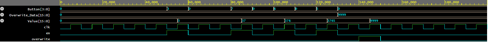

As you can see, the digits 3,7,6, and 5 are sequentially pressed. When en is monopulsed, they are rotated into the Value. Eventually, that number becomes 3675\. Perfect\! Then, 9999 is overwritten, and value updates accordingly. That's all, folks\!   
   
Here is a test of the operation subcomponent:
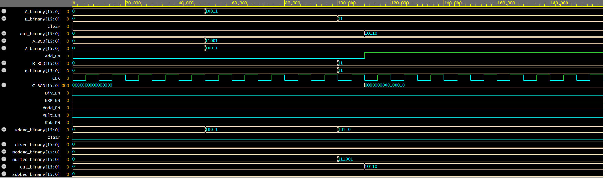  

It's synchronously adding 19 and 3, to get a result of 22, which is outputed when add\_en goes high\! You can see the conversion to binary in A/B\_binary from A/nB\_BCD. The output is C\_BCD. Note some other signals aren't calculated because their enable switches haven't triggered their processes yet.  

For further testing and more in-depth edge cases, check out the demo video. Just pressing the buttons is a lot quicker and more intuitive than writing up a VHDL testbench\! 

# **V.    Final code and result video:** 

Here is the final Vivado project: [https://drive.google.com/drive/folders/1d2J0BNk2c1Btt4WoSNh5Pf0QjvUrENCK?usp=sharing](https://drive.google.com/drive/folders/1d2J0BNk2c1Btt4WoSNh5Pf0QjvUrENCK?usp=sharing)  
There is also a folder called VHDL, which contains just the VHDL files. A zipped file is also attached on canvas. The demo video is also there. 

# **VI.    Reflections, wishes, and support acknowledgements**

Reflections and wishes:

Jake: What a ride it's been! I've gone from not knowing what in tarnation a flip-flop is to coding a calculator on an FPGA. Fun! The hardest part was definitely blocking out the design, assigning functionality to each section, and deciding on which signals to pass where. I'm a CS major so the coding was pretty easy. That being said, I did learn that for loops in VHDL are massively nerfed because of how a process works: the same variable can't be updated iteratively because it only changes at the end of the process! This property is unfortunate for the exponential function. Luckily, the work-around was pretty easy, and I could still use a for loop when going through regfile indexes. If I had another week or so to work on this project, I'd probably clean up the interaction between the Input Handler and the FSM. It'd be super easy to have the Input Handler put out a monopulsed button press for ever single button 0-F, and have the FSM check if it's an operator or not. That seems much cleaner than differentiating that beforehand and running three separate signals across. Plus, it makes the Input Handler more modular for other projects. Also, I could also have the datapath store the operation mode! I stored it in the FSM because I thought I'd code in different states for add_op, sub_op, etc., but that's completely unnecessary. In the future, I would store the operation mode in the datapath, and get rid of the six operation enable lines. That'd make the RTL diagram much cleaner and eliminate memory from the datapath. In addition, I'd've liked to add negative numbers, decimals, and numbers greater than 9999. I think having big numbers scroll across the screen like a stadium billboard would be pretty cool, but scientific notation is also possible.

Alek: Between the brainstorm, RTL, Coding, Simulating, and Hardware Implementation portions of this project, my mastery of modular organization was continuously tested. As a language, VHDL is incredibly unique in its compilation and structure and much, much different than any other programming language I know. Due to this difference in structure, it made the debugging process very difficult initially as I was forced to do much more on my end to debug in comparison to a 'higher up' language such as Python. Getting increasingly adept at finding these, usually small and hidden, errors across many different connected modules within this project greatly improved my understanding of how, beyond Vivado, a project of this design complexity should be broken down and solved. Working with a partner was also a great experience as it helped keep the project organized as to divide work flow and keep each other in check with our vision for each new component. Learning to work in unison helped produce well 'sculpted' ideas that ended up working in the long run. All in all, this project was a fantastic learning experience as it truly tested the mettle of my design-solving process on a larger scale.

Acknowledgments:   
A huge thank you to Tad Truex for teaching everything and being available for debugging and Vivado navigation. Also a big shout out to our TA Brandon for all the help and communication. It's been an intensive project (especially this six part writeup lol), but I've learned a ton.
